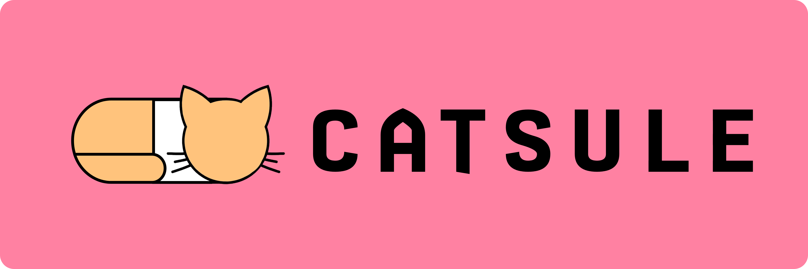

[](https://github.com/thekaushikls/Catsule/actions/workflows/release_ci.yml)
[](https://github.com/thekaushikls/Catsule/releases/latest)
[](https://github.com/thekaushikls/Catsule/blob/main/LICENSE)

<br>

Catsule is a workflow manager for Rhino / Grasshopper.

<br>

## **Feature List** 🎉

<br>

### **1. GhAutoload**
When a Rhino file **'abc.3dm'** is opened, a corresponding Grasshopper file, **'abc.gh'** is automatically opened. This setting can be enabled / disabled using the `GhSettings` command in Rhino.

<br>

### **2. GhSettings**
A Rhino command to **Enable / Disable** the GhAutoload feature. Changes are reflected the next time a New or Existing Rhino (.3dm) is opened.

<br>

### **3. GhReload**
A Rhino command to pseudo-reload the current Grasshopper Instance. Any open Grasshopper files are restored.

<br><br>

## **Frequently Asked Questions** 🙋

<br>

### **🟡 How to get Catsule?**
The recommended way is to use the PackageManager from Rhino, or by pasting the command below.

```
_-PackageManager Search Catsule
```

It can also be download from [food4rhino.com](https://www.food4rhino.com/en/app/catsule). The bleeding edge version can be downloaded from [releases](https://github.com/thekaushikls/Catsule/releases/latest)

<br>

### **🟡 Is Catsule free?**
Catsule falls under FOSS - Free and Open Source Software, and uses [AGPL v3 License](https://www.gnu.org/licenses/agpl-3.0.en.html).

<br>

### **🟡 Can I support Catsule development?**
You can show your support by buying me a [coffee](https://ko-fi.com/thekaushikls).